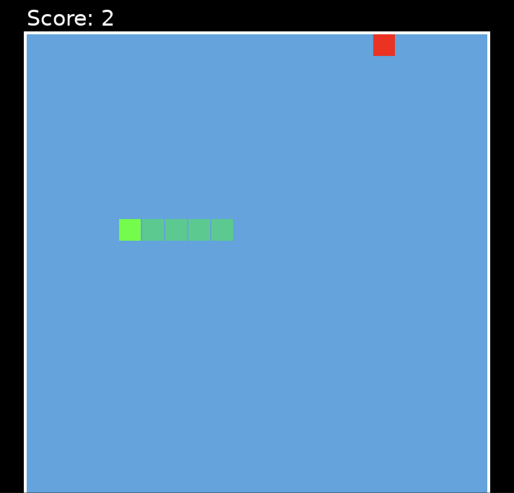

# Snake Implementation (Lua + Love2D)

A classic Snake game implemented in **Lua using the Love2D engine**.  
This project is part of the Snake Polyglot showcase, which demonstrates how to build the same game in various programming languages following a shared set of rules.

---

## 🎮 Dependencies

- Love2D (11.x or newer)

Download: https://love2d.org/

---

## ⚙️ Setup and Installation

Ensure Love2D is installed on your system.

No additional dependencies are required.

---

## ▶️ Running the Game

Open your terminal and navigate to the `lua-snake` directory:

cd lua-snake
love .

---

## Screenshot

---

## 🎮 Game Controls

- Move Up: W / Up Arrow  
- Move Down: S / Down Arrow  
- Move Left: A / Left Arrow  
- Move Right: D / Left Arrow  
- Restart: SPACE (if game over)

---

## Notes

- Love2D must be installed, but does NOT need to be in PATH if launched via GUI or `love .`
- Project entry point: `main.lua`