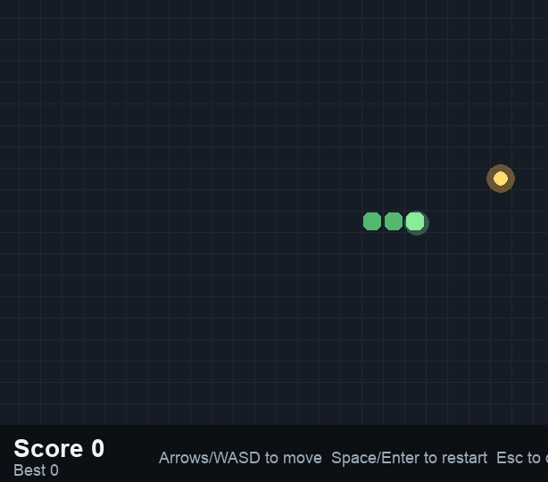

## snak3

Snake game using pygame library

### Setup
You need to install **[uv](https://docs.astral.sh/uv/getting-started/installation/)** first
After that:
```
git clone https://github.com/DevForgeTeam/snake-polyglot.git
cd snake-polyglot/snak3
```

### Running

```bash
uv sync
uv run main.py
```

### Usage

- Arrow Keys or WASD: movement
- Space / Enter: restart after game over
- Esc: exit

